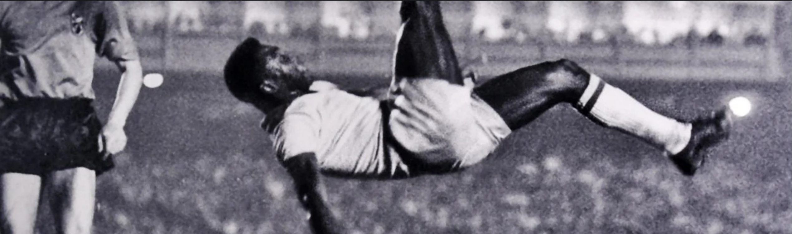
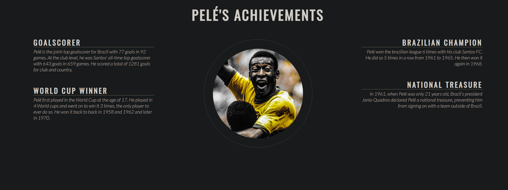
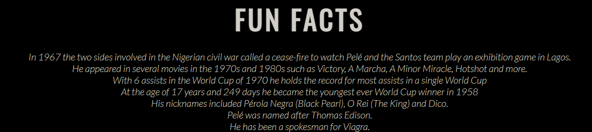

# Pelé history page

This site is a page with information about the history of the legendary football player Pelé. The site will be targeted towards people looking to know more about the history of Pelé after his recent passing.

## Existing Features

- __Navigation bar__

  - Featured at the top of the page, the navigation bar shows the website title in the left corner: RIP Pelé 1940-2022.
  - The navigation links are to the right. They both lead to the top of their respective pages.
  - The font of the navigation has good color contrasts with the background that makes it easy to read.

- __Header Image__

  - Featured right under the header.
  - A big opening image to showcase who the website is exactly about.

- __Pelé's achiemevents__

  - Featured in the middle of the page.
  - You can find his most impressive achievements here.
  - An image added in the middle of the achiemevents add extra style to the page.

- __Fun facts__

  - Featured above the footer of the page.
  - Here you can find some other interesting and fun facts about Pelé's life.

- __Footer__

  - Featured at the very bottom of the page.
  - You can find links to various social media pages of Pelé here.

## Features left to implement

- A gallery page

## Testing

### Validator Testing

- HTML
  - 1 error was returned when passing through the official [W3C validator](https://validator.w3.org/nu/?doc=https%3A%2F%2Fwhoelie.github.io%2FProject-1%2Findex.html)
  - Duplicate ID welcome. From line 69, column 13; to line 69, column 29
- CSS
  - no errors were found when passing through the official [(Jigsaw) validator](https://jigsaw.w3.org/css-validator/validator?uri=https%3A%2F%2Fwhoelie.github.io%2FProject-1%2Findex.html&profile=css3svg&usermedium=all&warning=1&vextwarning=&lang=en)

### Unfixed Bugs

Duplicate ID welcome. From line 69, column 13; to line 69, column 29

## Deployment

- The site was deployed to GitHub pages. The steps to deploy are as follows: 
  - In the GitHub repository, navigate to the Settings tab 
  - From the source section drop-down menu, select the Master Branch
  - Once the master branch has been selected, the page will be automatically refreshed with a detailed ribbon display to indicate the successful deployment. 

## Credits

### Content

- The text for the achievements and fun facts were found on Pelé's wikipedia page https://en.wikipedia.org/wiki/Pel%C3%A9

### Media

- Photos used were taken from this open source website https://www.pxfuel.com/

### Code/layout

- The layout of the achievements was taken from the Love Running project, along with the header and footer.
